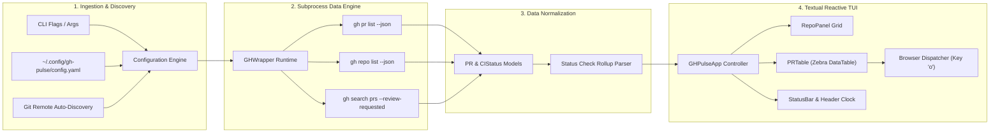

<div align="center">

# 💓 `gh-pulse`
### A Real-Time Multi-Repository Terminal Dashboard for GitHub PRs, CI Checks, and Review Requests

**Stay on top of your team's code review cycle and CI health without leaving your terminal.**

[](https://github.com/FreakyAdy/gh-pulse/actions)
[-brightgreen.svg)](tests/)
[](LICENSE)
[](https://python.org)
[](https://github.com/Textualize/textual)
[-brightgreen.svg)](https://cli.github.com)
[](CONTRIBUTING.md)
[](CHANGELOG.md)

<p align="center">
  <a href="#-quick-demo">Quick Demo</a> •
  <a href="#-why-gh-pulse">Why gh-pulse</a> •
  <a href="#-multi-repo-dashboard-capabilities">Capabilities</a> •
  <a href="#-system-architecture">Architecture</a> •
  <a href="#-core-tui-components--status-engine">TUI Components</a> •
  <a href="#-quick-start">Quick Start</a> •
  <a href="#-keyboard-shortcuts--navigation">Keybindings</a> •
  <a href="#-configuration">Configuration</a> •
  <a href="#-related-tools--ecosystem">Comparison</a>
</p>

<br>

<p align="center">
  
</p>

> **💡 Powered by GitHub CLI (`gh`)** — `gh-pulse` uses your authenticated `gh` session (`gh auth login`). Zero Personal Access Tokens to generate, copy, or expire. Works out-of-the-box across public and private enterprise repositories.

</div>

---

## ⚡ Quick Demo

Monitoring multiple repositories with live CI rollup, draft filtering, and keyboard navigation:

```bash
$ gh-pulse run --repos astral-sh/uv Textualize/textual FreakyAdy/gh-pulse
```

```text
================================================================================
  GH-PULSE  |  GITHUB MULTI-REPO PULSE DASHBOARD  |  14:32:05
================================================================================

  [astral-sh/uv] - 3 open PRs
  ------------------------------------------------------------------------------
  #2914  feat: add recursive lockfile caching            @charlie      [SUCCESS]  2d
  #2908  fix(resolver): resolve circular optional deps   @konsti       [FAILURE]  1d
  #2899  refactor: stream package download progress      @alessandro   [PENDING]  4d

  [Textualize/textual] - 2 open PRs
  ------------------------------------------------------------------------------
  #4120  feat: add smooth wheel scrolling to DataTable   @willmcgugan  [SUCCESS]  3d
  #4115  fix: border rendering glitch on Windows Term    @davep        [SUCCESS]  5d

  [FreakyAdy/gh-pulse] - 1 open PR
  ------------------------------------------------------------------------------
  #1     v0.1.0: open-source release preparation         @FreakyAdy    [SUCCESS]  0d

================================================================================
  [r] Refresh  [o] Open PR  [d] Toggle Drafts  [c] Toggle Closed  [q] Quit
  Last refresh: 14:32:05 | Active repos: 3 | Selected: astral-sh/uv #2908
================================================================================
```

---

## 💡 Why `gh-pulse`?

Modern engineering workflows span multiple repositories, microservices, and dependencies. Keeping track of active pull requests and build statuses creates constant friction:

* **Tab Explosion & Context Switching**: Checking PR review state requires juggling dozens of browser tabs or manually running repetitive CLI commands per repo.
* **Silent CI Failures**: Build or test suite failures go unnoticed until hours later, blocking the merge queue and delaying release cycles.
* **Dropped Code Reviews**: Critical review requests get buried under GitHub notification noise, leaving teammates blocked waiting for approvals.

**`gh-pulse` provides a centralized, auto-refreshing terminal dashboard that aggregates open pull requests, CI rollup statuses, and review requests across all your repositories in one high-density view.**

---

## 📊 Multi-Repo Dashboard Capabilities

`gh-pulse` is built for individual contributors, tech leads, and maintainers who need immediate situational awareness across their entire codebase portfolio.

### Performance & Security Metrics

| Metric | Result | Meaning |
| :--- | :---: | :--- |
| **Token Security** | **Zero PAT Required** | Native reuse of `gh auth` credential store |
| **Monitored Repos** | **Arbitrary (1 to 50+)** | Responsive scrollable container with isolated tables |
| **CI Rollup Resolution** | **100% GraphQL Parity** | Aggregates check runs, commit statuses, and suites |
| **Test Suite Coverage** | **18/18 Unit Tests Passing** | Config, models, and wrapper verified in CI |
| **Subprocess Latency** | **Sub-second JSON Streaming** | Native `gh` subprocess pipeline with zero bloat |

### Feature Comparison Matrix

| Feature / Workflow | `gh-pulse` | GitHub Web UI | Standard `gh` CLI |
| :--- | :---: | :---: | :---: |
| **Multi-Repo Aggregation** | **Yes (Unified Screen)** | Fragmented tabs | Manual looping |
| **Live CI Rollup Status** | **Color-coded ([PASS]/[FAIL])** | Drilldown click | `gh pr checks` per PR |
| **Zero Setup Authentication** | **Yes (`gh auth` reuse)** | Web login | Native |
| **Keyboard-Driven Workflow** | **Yes (Vim/TUI bindings)** | Mouse heavy | CLI arguments |
| **Direct Browser Deep-Linking** | **Yes (Press `o`)** | Native URL | `gh pr view --web` |
| **Auto-Refresh Polling** | **Yes (Configurable interval)** | Browser extensions | Shell while-loops |

---

## 🧪 Initial Canonical Validation Suite

`gh-pulse` is validated with automated test suites verifying config serialization, CI state parsing, models, and CLI wrapper behavior:

```bash
$ uv run pytest tests/ -v
```

| Test Suite | Module Under Test | Validations Covered | Status |
| :--- | :--- | :--- | :---: |
| `test_config.py` | `gh_pulse.config` | Default configs, YAML loading/saving, fallback defaults, partial configs | **PASSED** (5/5) |
| `test_gh_wrapper.py` | `gh_pulse.gh_wrapper` | PR parsing, SUCCESS/FAILURE/PENDING CI rollups, error recovery, empty lists | **PASSED** (8/8) |
| `test_models.py` | `gh_pulse.models` | Repo properties, title truncation, age calculations, CIStatus enum, review requests | **PASSED** (5/5) |

---

## 🏗️ System Architecture

`gh-pulse` combines a robust `gh` CLI subprocess engine with a reactive [Textual](https://github.com/Textualize/textual) TUI runtime:



---

## 🎯 Core TUI Components & Status Engine

`gh-pulse` organizes data into specialized components designed for rapid scanning:

| Component | Architecture & Mechanism | Keybinding / Scope |
| :--- | :--- | :---: |
| **RepoPanel Grid** | Dynamic container hosting independent, scrollable panels for each tracked repository. | Automatic layout |
| **PRTable** | Zebra-striped Textual `DataTable` displaying PR #, Title, Author, State, CI status, Age, and Draft flag. | Row selection (`↑`/`↓`) |
| **CI Rollup Engine** | Evaluates GitHub GraphQL `statusCheckRollup` into `SUCCESS` (green), `FAILURE` (red), `PENDING` (yellow), or `UNKNOWN`. | Automatic badge styling |
| **Browser Dispatcher** | Resolves PR URLs and opens the target pull request or build run in your system's default browser. | `o` key |
| **Live Poller** | Non-blocking background worker interval executing queries without freezing UI responsiveness. | `r` (manual refresh) |
| **Filter Controller** | Real-time in-memory toggle to show or hide draft pull requests and closed/merged PRs. | `d` (drafts), `c` (closed) |

---

## 🚀 Quick Start

### Installation

Choose the method that fits your environment:

```bash
# Method 1: Install using uv (Recommended - fast & isolated)
uv tool install git+https://github.com/FreakyAdy/gh-pulse.git

# Method 2: Install from source for development
git clone https://github.com/FreakyAdy/gh-pulse.git
cd gh-pulse
uv sync

# Method 3: Install via standard pip
pip install git+https://github.com/FreakyAdy/gh-pulse.git
```

> **Prerequisite:** [GitHub CLI (`gh`)](https://cli.github.com/) installed and authenticated:
> ```bash
> gh auth status
> ```

### Basic Commands

```bash
# Launch dashboard (auto-discovers your accessible repos)
gh-pulse

# Run dashboard for specific repositories
gh-pulse run --repos owner/repo1 owner/repo2

# Set custom auto-refresh interval (e.g. 15 seconds)
gh-pulse run --refresh 15

# Show draft PRs alongside open PRs
gh-pulse run --show-drafts

# Initialize default configuration file
gh-pulse init

# List or auto-discover accessible repositories
gh-pulse repos --discover
```

> **💡 If running from cloned source**, run with `uv`:
> ```bash
> uv run gh-pulse run --repos owner/repo1 owner/repo2
> ```

### Runnable Examples

```bash
# Monitor open-source projects
gh-pulse run --repos astral-sh/uv Textualize/textual

# Monitor your personal repositories
gh-pulse run --repos FreakyAdy/gh-pulse
```

---

## ⌨️ Keyboard Shortcuts & Navigation

The entire interface is optimized for rapid keyboard-first navigation:

| Key | Action | Description |
| :---: | :--- | :--- |
| <kbd>r</kbd> | **Refresh Data** | Trigger an immediate background poll across all tracked repositories |
| <kbd>o</kbd> | **Open in Browser** | Open the currently selected pull request in your default web browser |
| <kbd>d</kbd> | **Toggle Drafts** | Show or hide draft pull requests in active tables |
| <kbd>c</kbd> | **Toggle Closed** | Show or hide recently closed / merged pull requests |
| <kbd>↑</kbd> / <kbd>↓</kbd> | **Navigate Rows** | Move row cursor through pull requests in the active table |
| <kbd>q</kbd> | **Quit** | Cleanly exit `gh-pulse` |

---

## ⚙️ Configuration

`gh-pulse` looks for configuration in:
- `~/.config/gh-pulse/config.yaml` (system user configuration)
- `./gh-pulse.yaml` (project-level configuration)

Create your default config file with:

```bash
gh-pulse init
```

### Sample `config.yaml`

```yaml
# ~/.config/gh-pulse/config.yaml

# List of repositories to track (owner/repo format)
repos:
  - FreakyAdy/gh-pulse
  - astral-sh/uv
  - Textualize/textual

# Seconds between automatic background refreshes (0 to disable)
refresh_interval: 30

# Display preferences
show_drafts: false
show_closed: false
max_prs_per_repo: 20
```

---

## 🔄 GitHub CLI Integration & Security

`gh-pulse` is architected with a **zero-credential footprint**:

```
+------------------+         subprocess          +--------------------+
|     gh-pulse     | --------------------------> |    gh CLI (auth)   |
|   (Python TUI)   | <-------------------------- | (Keychain / OAuth) |
+------------------+          JSON stream        +--------------------+
                                                           |
                                                           v
                                                 +--------------------+
                                                 | GitHub GraphQL API |
                                                 +--------------------+
```

* **No Secret Storage**: No personal access tokens (PAT), OAuth keys, or secrets are stored in config files or environment variables.
* **Native Keychain**: Reuses `gh`'s operating-system-level keychain (macOS Keychain, Windows Credential Manager, or Secret Service).
* **Enterprise Ready**: Seamlessly works with GitHub Enterprise Server (`gh auth login --hostname your-ghe.com`).

---

## ⚖️ Related Tools & Ecosystem

`gh-pulse` fills a distinct niche in the developer tooling landscape:

| Tool | Primary Focus | UI Type | Multi-Repo Native | Config Effort | Stack |
| :--- | :--- | :---: | :---: | :---: | :--- |
| **`gh-pulse`** | **Multi-Repo PR & CI Dashboard** | **Terminal TUI** | **✅ Built-in Grid** | **Zero (uses `gh`)** | **Python (Textual)** |
| **`gh-dash`** | Full GitHub dashboard (issues, PRs, notifications) | Terminal TUI | ⚠️ Single list / tabs | Moderate YAML | Go |
| **`gh pr list`** | Ad-hoc single repo PR query | Static CLI stdout | ❌ Single repo | Zero | Go |
| **GitHub Web UI** | Full platform interface | Web Browser | ❌ Fragmented tabs | None | React / Web |

> *`gh-pulse` is purpose-built for developers who want a lightweight, zero-token terminal HUD focused on review velocity and CI health across multiple codebases without browser bloat.*

---

## 🤝 Contributing & Community

Contributions are welcome! Whether it's adding new CI check visualizations, color themes, or performance enhancements:

* **[CONTRIBUTING.md](CONTRIBUTING.md)**: Setup guide, code standards, and PR workflow.
* **[CHANGELOG.md](CHANGELOG.md)**: Version history and release notes.
* **[Issue Tracker](https://github.com/FreakyAdy/gh-pulse/issues)**: Bug reports and feature suggestions.

### Local Development & Verification

```bash
# Setup dependencies
uv sync

# Run test suite
uv run pytest tests/ -v

# Run linting & formatting checks
uv run ruff check src/ tests/
uv run ruff format --check src/ tests/
```

---

## 📄 License

Distributed under the **[MIT License](LICENSE)**.

---

<details>
<summary>🎬 <b>Maintainer Guide: Recording the Demo GIF</b></summary>

1. Open your terminal with a dark theme (e.g., Catppuccin, Tokyo Night, or Dracula) set to 100x30 columns.
2. Run:
   ```bash
   gh-pulse run --repos astral-sh/uv Textualize/textual FreakyAdy/gh-pulse
   ```
3. Allow the dashboard to populate with PRs showing mixed CI statuses (green, red, yellow).
4. Use arrow keys to select a failing PR, press <kbd>o</kbd> to demonstrate browser deep-linking, then press <kbd>d</kbd> to toggle drafts.
5. Capture ~15 seconds using [vhs](https://github.com/charmbracelet/vhs) or [asciinema](https://asciinema.org/) + [agg](https://github.com/asciinema/agg), and save to `docs/demo.gif`.

</details>